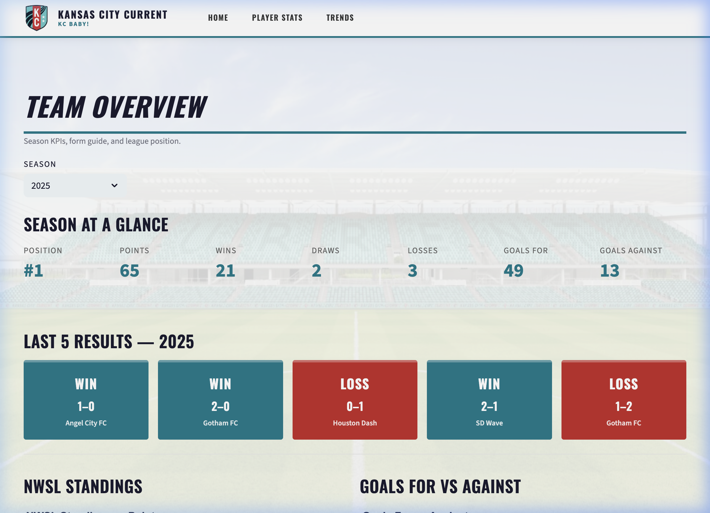
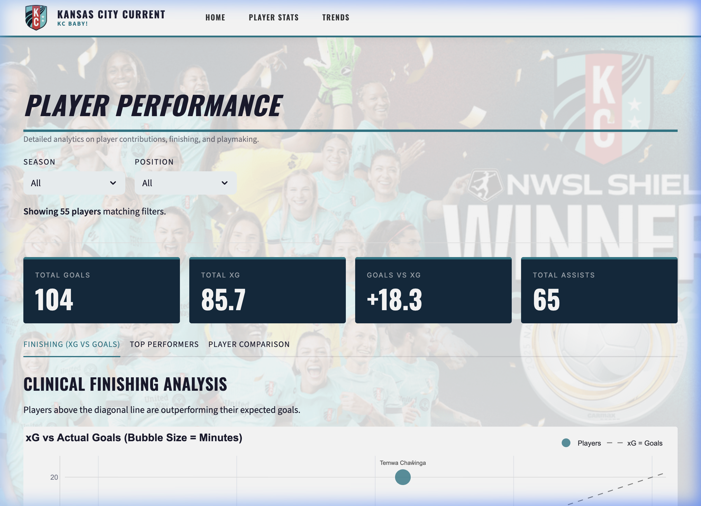
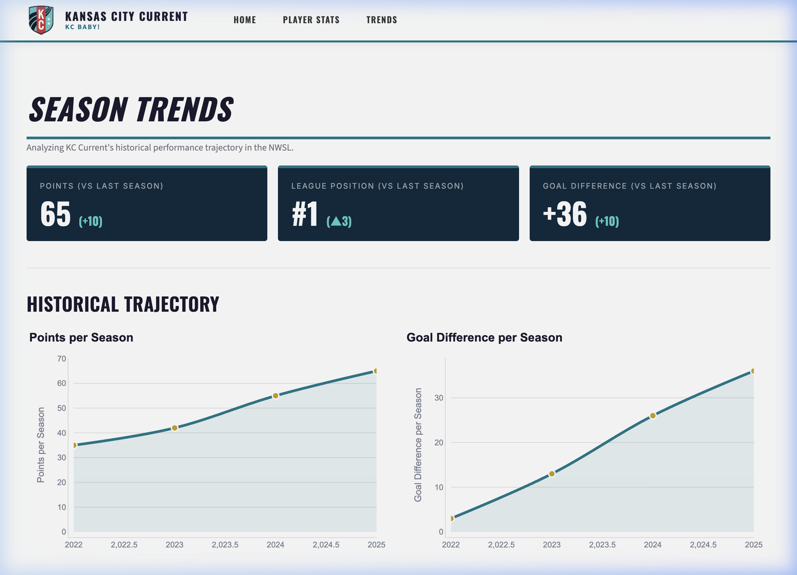

# KC Current Analytics Dashboard

> A professional analytics dashboard for **Kansas City Current** (NWSL), built with Streamlit and styled to match the official [kansascitycurrent.com](https://www.kansascitycurrent.com) aesthetic.



---

## 📊 Pages

### 🏠 Team Overview
Season KPIs at a glance — standings position, points, wins/draws/losses, goals for/against. Includes the last 5 match results with a color-coded form guide (W/D/L), NWSL standings bar chart, and a match goal-difference timeline.



### ⚽ Player Performance
Deep dive into individual player analytics:
- **KPI Cards** — Total Goals, xG, Goals vs xG, Assists
- **Finishing Analysis** — xG vs Actual Goals bubble chart (bubble = minutes played)
- **Top Performers** — Ranked bar charts for goals & assists
- **Player Comparison** — Radar chart for comparing up to 3 players across key metrics
- **Raw Data Table** — Full sortable/filterable player stats



### 📈 Season Trends
Multi-season historical trajectory for the club:
- Year-over-year KPI cards (points, league position, goal difference)
- Trend line charts for points, finishing position, GD, and wins per season
- Goals scored vs conceded over time

---

## 🗂️ Project Structure

```
kc-current-dashboard/
├── app.py                  # Entry point — global theme + nav header
├── pages/
│   ├── 1_Team_Overview.py
│   ├── 2_Player_Performance.py
│   └── 3_Season_Trends.py
├── utils/
│   ├── cache.py            # Data loading with st.cache_data
│   ├── charts.py           # Plotly chart functions
│   └── constants.py        # Brand colors and shared constants
├── pipeline/
│   ├── fbref_scraper.py    # FBRef data scraper
│   ├── espn_api.py         # ESPN schedule data
│   ├── nwsl_api.py         # NWSL standings
│   └── transformer.py      # Data cleaning & transformation
├── data/
│   ├── processed/          # Cleaned CSVs loaded by the app
│   └── raw/                # Raw scraped text files
├── assets/
│   ├── kc_logo.png         # KC Current shield logo
│   └── team_bg.jpeg        # Team Overview background image
├── run_pipeline.py         # Run full data pipeline
└── requirements.txt
```

---

## 🚀 Getting Started

### 1. Install dependencies
```bash
pip install -r requirements.txt
```

### 2. Run the data pipeline
```bash
python run_pipeline.py
```

### 3. Launch the dashboard
```bash
streamlit run app.py
```

Then open **http://localhost:8501** in your browser.

---

## 🛠️ Tech Stack

| Layer | Technology |
|-------|------------|
| Frontend | [Streamlit](https://streamlit.io) |
| Charts | [Plotly](https://plotly.com/python/) |
| Data | Pandas, FBRef scraper, ESPN API |
| Styling | Custom CSS — Oswald font, KC Current brand colors |
| Data Sources | FBRef (player stats), ESPN (schedule), NWSL API (standings) |

---

## 🎨 Design

Themed after the official **Kansas City Current** website:
- **Oswald** bold italic uppercase headings
- **Teal `#007A8A`** as the primary accent color
- **Dark navy `#0D2B3E`** KPI cards
- Clean white background with team photo backgrounds

---

## 📋 Requirements

```
streamlit>=1.35
pandas
plotly
requests
beautifulsoup4
```

---

*Built by Rohan Anthony • Data sourced from FBRef & ESPN*
